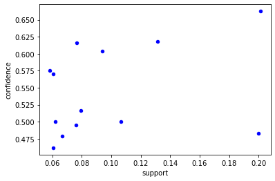
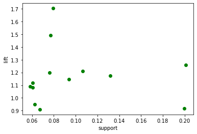
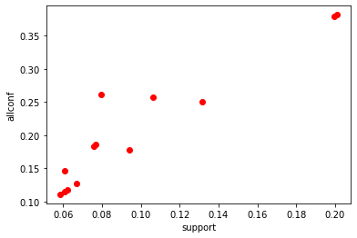
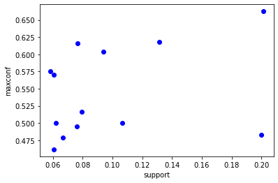
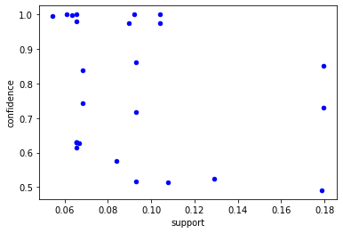
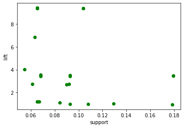
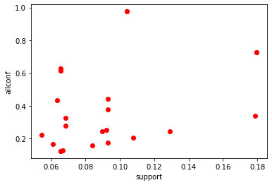
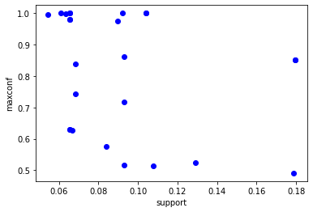

# 数据挖掘课程作业
### 第6周    肖克  3220211086
---

## 1. 问题描述
 * 本次作业中，将选择1个数据集进行频繁模式和关联规则挖掘。

## 2. 数据说明
 * 数据集与第一次互评作业的数据集范围是相同的，在选择的时候可以选择之前预处理的数据集，也可以重新选择一个。

## 3. 数据分析要求
 * 对数据集进行处理，转换成适合进行关联规则挖掘的形式；
 * 找出频繁模式；
 * 导出关联规则，计算其支持度和置信度;
 * 对规则进行评价，可使用Lift、卡方和其它教材中提及的指标, 至少2种；
 * 对挖掘结果进行分析；
 * 可视化展示。
 
## 4. 提交的内容
 * 对数据集进行处理的代码
 * 关联规则挖掘的代码
 * 挖掘过程的报告：展示挖掘的过程、结果和你的分析
 * 所选择的数据集在README中说明，数据文件不要上传到Github中
 

## 使用的数据集说明

本次作业使用的数据集是来自Wine Reviews中的'winemag-data_first150k.csv'文件和'winemag-data-130k-v2.csv'文件:
 * winemag-data_first150k.csv文件一共有10列，包括了150,000+条红酒的信息，包含了国家、地区、价格、评论等属性；
 * winemag-data-130k-v2.csv文件同样共有10列，但包括了130,000+条红酒的信息。
 数据集中包含的属性有：
  - country 国家
  - desprition 描述
  - designation 葡萄酒庄：生产该葡萄酒所在的酒庄
  - pints 得分：经过上一次作业的分析，得分的分布在[80,100]之间
  - price 价格：价格主要分布在[4,100]之间，也存在一些价格高于该区间的数据
  - province 省份：生产该葡萄酒的省或州
  - region_1 区域1：生产该葡萄酒的省或州的一个产区
  - region_2 区域2：在葡萄酒产区中更精确的区域
  - variety 葡萄种类：用于酿造葡萄酒的葡萄类型
  - winery 酿酒厂
 
 在这些属性中，有一部分对数据挖掘并没有任何帮助，如：
  * 第1列属性为未命名的数据的序号，对挖掘工作没有帮助，不予考虑；
  * 'desprition'属性：这是品酒师或消费者对葡萄酒进行的文字评论，在接下来的工作中不予考虑；
  * 'province'属性：生产葡萄酒的州或省，在接下来的工作中，与区域相关的关联和模式主要是围绕'country'进行的；
  * 'region_1'和'region_2'属性同上所述，不予考虑。

首先将winemag-data_first150k.csv数据集导入：


```python
import pandas as pd
data_frame_wine15 = pd.read_csv("F:/dataMining/winemag-data_first150k.csv", index_col=[0])
data_frame_wine15.head(2)
```


<div>
<style scoped>
    .dataframe tbody tr th:only-of-type {
        vertical-align: middle;
    }

    .dataframe tbody tr th {
        vertical-align: top;
    }

    .dataframe thead th {
        text-align: right;
    }
</style>
<table border="1" class="dataframe">
  <thead>
    <tr style="text-align: right;">
      <th></th>
      <th>country</th>
      <th>description</th>
      <th>designation</th>
      <th>points</th>
      <th>price</th>
      <th>province</th>
      <th>region_1</th>
      <th>region_2</th>
      <th>variety</th>
      <th>winery</th>
    </tr>
  </thead>
  <tbody>
    <tr>
      <th>0</th>
      <td>US</td>
      <td>This tremendous 100% varietal wine hails from ...</td>
      <td>Martha's Vineyard</td>
      <td>96</td>
      <td>235.0</td>
      <td>California</td>
      <td>Napa Valley</td>
      <td>Napa</td>
      <td>Cabernet Sauvignon</td>
      <td>Heitz</td>
    </tr>
    <tr>
      <th>1</th>
      <td>Spain</td>
      <td>Ripe aromas of fig, blackberry and cassis are ...</td>
      <td>Carodorum Selección Especial Reserva</td>
      <td>96</td>
      <td>110.0</td>
      <td>Northern Spain</td>
      <td>Toro</td>
      <td>NaN</td>
      <td>Tinta de Toro</td>
      <td>Bodega Carmen Rodríguez</td>
    </tr>
  </tbody>
</table>
</div>


首先并按照在使用的数据集说明中删除一部分属性后，再观察属性中包含哪些数值属性


```python
# 打印数据的列信息，并判断是否为数值属性,删除不使用的属性
data_frame_wine15 = data_frame_wine15.drop(['description','province','region_1','region_2'], axis=1)
print(data_frame_wine15.info())
data_frame_wine15.head(2)
```

    <class 'pandas.core.frame.DataFrame'>
    Int64Index: 150930 entries, 0 to 150929
    Data columns (total 6 columns):
     #   Column       Non-Null Count   Dtype  
    ---  ------       --------------   -----  
     0   country      150925 non-null  object 
     1   designation  105195 non-null  object 
     2   points       150930 non-null  int64  
     3   price        137235 non-null  float64
     4   variety      150930 non-null  object 
     5   winery       150930 non-null  object 
    dtypes: float64(1), int64(1), object(4)
    memory usage: 8.1+ MB
    None
    


<div>
<style scoped>
    .dataframe tbody tr th:only-of-type {
        vertical-align: middle;
    }

    .dataframe tbody tr th {
        vertical-align: top;
    }

    .dataframe thead th {
        text-align: right;
    }
</style>
<table border="1" class="dataframe">
  <thead>
    <tr style="text-align: right;">
      <th></th>
      <th>country</th>
      <th>designation</th>
      <th>points</th>
      <th>price</th>
      <th>variety</th>
      <th>winery</th>
    </tr>
  </thead>
  <tbody>
    <tr>
      <th>0</th>
      <td>US</td>
      <td>Martha's Vineyard</td>
      <td>96</td>
      <td>235.0</td>
      <td>Cabernet Sauvignon</td>
      <td>Heitz</td>
    </tr>
    <tr>
      <th>1</th>
      <td>Spain</td>
      <td>Carodorum Selección Especial Reserva</td>
      <td>96</td>
      <td>110.0</td>
      <td>Tinta de Toro</td>
      <td>Bodega Carmen Rodríguez</td>
    </tr>
  </tbody>
</table>
</div>


在之前的作业中得知country属性中存在着缺失值，而缺失值可以由对应数据的designation属性，即酒庄信息得到：


```python
# 寻找country属性为空的数据
for i in range(0, len(data_frame_wine15)):
    tmp = data_frame_wine15.iloc[i, 0]
    if pd.isnull(tmp):
        print(str(data_frame_wine15.iloc[i, 0]) + "====>" + str(data_frame_wine15.iloc[i, 1]))
```

    nan====>Askitikos
    nan====>Shah
    nan====>Piedra Feliz
    nan====>Piedra Feliz
    nan====>Piedra Feliz
    


```python
# 根据designation，将缺失的country属性填充上
dic = {"Askitikos": "Greece", "Shah": "US", "Piedra Feliz": "Chile"}
for i in range(0, len(data_frame_wine15)):
    tmp = data_frame_wine15.iloc[i, 0]
    if pd.isnull(tmp):
        designation = data_frame_wine15.iloc[i, 1]
        data_frame_wine15.iloc[i, 0] = dic[designation]
```

在之前的作业过程中，了解到了一些关于points和price属性的相关信息，这里要对两个数值属性进行离散化处理
同时，为price和points属性加上前缀，加以区分并便于分析


```python
# 对points属性进行离散化并加上前缀
def points_discretization(value):
    return "points_class:" + str(int(value / 5))

# 对price属性进行离散化并加上前缀
def price_discretization(value):
    if value < 100:
        return "price_class:" + str(int(value / 10))
    else:
        return "price_class:10"
data_frame_wine15 = data_frame_wine15.drop(['designation','variety', 'winery'], axis=1)
data_frame_wine15.loc[:, 'points'] = data_frame_wine15['points'].map(lambda x: points_discretization(x))
data_frame_wine15.loc[:, 'price'] = data_frame_wine15['price'].map(lambda x: price_discretization(x))
data_frame_wine15.head(2)
```


<div>
<style scoped>
    .dataframe tbody tr th:only-of-type {
        vertical-align: middle;
    }

    .dataframe tbody tr th {
        vertical-align: top;
    }

    .dataframe thead th {
        text-align: right;
    }
</style>
<table border="1" class="dataframe">
  <thead>
    <tr style="text-align: right;">
      <th></th>
      <th>country</th>
      <th>points</th>
      <th>price</th>
    </tr>
  </thead>
  <tbody>
    <tr>
      <th>0</th>
      <td>US</td>
      <td>points_class:19</td>
      <td>price_class:10</td>
    </tr>
    <tr>
      <th>1</th>
      <td>Spain</td>
      <td>points_class:19</td>
      <td>price_class:10</td>
    </tr>
  </tbody>
</table>
</div>


 *注意将price和points属性离散化后的表示形式，上方两条数据中points_class:19的含义即为得分在[95,99]中，而price_class:10的含义为该款葡萄酒的价格在$100以上。

接下来先将数据帧中的列转换为列表，准备使用mlxtend库进行数据挖掘


```python
# 将读取到的dataframe转换为列表
def deal(data):
    return data.to_list()
data_frame_wine15_arr = data_frame_wine15.apply(deal, axis=1).tolist()
```


<div>
<style scoped>
    .dataframe tbody tr th:only-of-type {
        vertical-align: middle;
    }

    .dataframe tbody tr th {
        vertical-align: top;
    }

    .dataframe thead th {
        text-align: right;
    }
</style>
<table border="1" class="dataframe">
  <thead>
    <tr style="text-align: right;">
      <th></th>
      <th>country</th>
      <th>points</th>
      <th>price</th>
    </tr>
  </thead>
  <tbody>
    <tr>
      <th>0</th>
      <td>US</td>
      <td>points_class:19</td>
      <td>price_class:10</td>
    </tr>
    <tr>
      <th>1</th>
      <td>Spain</td>
      <td>points_class:19</td>
      <td>price_class:10</td>
    </tr>
  </tbody>
</table>
</div>


```python
from mlxtend.preprocessing import TransactionEncoder
te = TransactionEncoder()
tf = te.fit_transform(data_frame_wine15_arr)
new_df = pd.DataFrame(tf, columns=te.columns_)
```

通过使用mlxtend中的apriori函数寻找频繁模式，在本实验中，将最小支持度阈值设置为0.05


```python
from mlxtend.frequent_patterns import apriori
df_after_apriori = apriori(new_df, min_support=0.05, use_colnames=True, max_len=4).sort_values(by='support', ascending=False)
print(df_after_apriori.shape)
```

    (29, 2)
    


```python
df_after_apriori[:20]
```


<div>
<style scoped>
    .dataframe tbody tr th:only-of-type {
        vertical-align: middle;
    }

    .dataframe tbody tr th {
        vertical-align: top;
    }

    .dataframe thead th {
        text-align: right;
    }
</style>
<table border="1" class="dataframe">
  <thead>
    <tr style="text-align: right;">
      <th></th>
      <th>support</th>
      <th>itemsets</th>
    </tr>
  </thead>
  <tbody>
    <tr>
      <th>5</th>
      <td>0.526887</td>
      <td>(points_class:17)</td>
    </tr>
    <tr>
      <th>3</th>
      <td>0.413423</td>
      <td>(US)</td>
    </tr>
    <tr>
      <th>7</th>
      <td>0.303419</td>
      <td>(price_class:1)</td>
    </tr>
    <tr>
      <th>6</th>
      <td>0.299669</td>
      <td>(points_class:18)</td>
    </tr>
    <tr>
      <th>9</th>
      <td>0.212986</td>
      <td>(price_class:2)</td>
    </tr>
    <tr>
      <th>22</th>
      <td>0.201034</td>
      <td>(price_class:1, points_class:17)</td>
    </tr>
    <tr>
      <th>16</th>
      <td>0.199788</td>
      <td>(points_class:17, US)</td>
    </tr>
    <tr>
      <th>1</th>
      <td>0.155556</td>
      <td>(Italy)</td>
    </tr>
    <tr>
      <th>4</th>
      <td>0.153694</td>
      <td>(points_class:16)</td>
    </tr>
    <tr>
      <th>0</th>
      <td>0.139787</td>
      <td>(France)</td>
    </tr>
    <tr>
      <th>23</th>
      <td>0.131604</td>
      <td>(price_class:2, points_class:17)</td>
    </tr>
    <tr>
      <th>17</th>
      <td>0.128748</td>
      <td>(points_class:18, US)</td>
    </tr>
    <tr>
      <th>10</th>
      <td>0.124554</td>
      <td>(price_class:3)</td>
    </tr>
    <tr>
      <th>8</th>
      <td>0.118121</td>
      <td>(price_class:10)</td>
    </tr>
    <tr>
      <th>19</th>
      <td>0.106460</td>
      <td>(price_class:2, US)</td>
    </tr>
    <tr>
      <th>18</th>
      <td>0.101617</td>
      <td>(price_class:1, US)</td>
    </tr>
    <tr>
      <th>14</th>
      <td>0.093964</td>
      <td>(Italy, points_class:17)</td>
    </tr>
    <tr>
      <th>11</th>
      <td>0.082840</td>
      <td>(price_class:4)</td>
    </tr>
    <tr>
      <th>21</th>
      <td>0.079454</td>
      <td>(price_class:1, points_class:16)</td>
    </tr>
    <tr>
      <th>20</th>
      <td>0.076784</td>
      <td>(price_class:3, US)</td>
    </tr>
  </tbody>
</table>
</div>


在得到了频繁项集之后，便可以从中导出关联规则。通过使用mlxtend包中的association_rules方法便可以计算支持度、置信度等信息。
在这里将支持度阈值为0.05，置信度阈值设为0.45，方法默认状态下还会计算关联规则的Lift指标，即提升度。


```python
from mlxtend.frequent_patterns import association_rules
the_rules = association_rules(df_after_apriori, metric='confidence', min_threshold=0.45)
the_rules = the_rules.drop(['leverage', 'conviction'], axis=1)
print(the_rules.shape)
```

    (13, 7)
    


```python
the_rules
```


<div>
<style scoped>
    .dataframe tbody tr th:only-of-type {
        vertical-align: middle;
    }

    .dataframe tbody tr th {
        vertical-align: top;
    }

    .dataframe thead th {
        text-align: right;
    }
</style>
<table border="1" class="dataframe">
  <thead>
    <tr style="text-align: right;">
      <th></th>
      <th>antecedents</th>
      <th>consequents</th>
      <th>antecedent support</th>
      <th>consequent support</th>
      <th>support</th>
      <th>confidence</th>
      <th>lift</th>
    </tr>
  </thead>
  <tbody>
    <tr>
      <th>0</th>
      <td>(price_class:1)</td>
      <td>(points_class:17)</td>
      <td>0.303419</td>
      <td>0.526887</td>
      <td>0.201034</td>
      <td>0.662561</td>
      <td>1.257503</td>
    </tr>
    <tr>
      <th>1</th>
      <td>(US)</td>
      <td>(points_class:17)</td>
      <td>0.413423</td>
      <td>0.526887</td>
      <td>0.199788</td>
      <td>0.483253</td>
      <td>0.917185</td>
    </tr>
    <tr>
      <th>2</th>
      <td>(price_class:2)</td>
      <td>(points_class:17)</td>
      <td>0.212986</td>
      <td>0.526887</td>
      <td>0.131604</td>
      <td>0.617900</td>
      <td>1.172737</td>
    </tr>
    <tr>
      <th>3</th>
      <td>(price_class:2)</td>
      <td>(US)</td>
      <td>0.212986</td>
      <td>0.413423</td>
      <td>0.106460</td>
      <td>0.499844</td>
      <td>1.209038</td>
    </tr>
    <tr>
      <th>4</th>
      <td>(Italy)</td>
      <td>(points_class:17)</td>
      <td>0.155556</td>
      <td>0.526887</td>
      <td>0.093964</td>
      <td>0.604055</td>
      <td>1.146461</td>
    </tr>
    <tr>
      <th>5</th>
      <td>(points_class:16)</td>
      <td>(price_class:1)</td>
      <td>0.153694</td>
      <td>0.303419</td>
      <td>0.079454</td>
      <td>0.516963</td>
      <td>1.703795</td>
    </tr>
    <tr>
      <th>6</th>
      <td>(price_class:3)</td>
      <td>(US)</td>
      <td>0.124554</td>
      <td>0.413423</td>
      <td>0.076784</td>
      <td>0.616469</td>
      <td>1.491132</td>
    </tr>
    <tr>
      <th>7</th>
      <td>(points_class:16)</td>
      <td>(US)</td>
      <td>0.153694</td>
      <td>0.413423</td>
      <td>0.076048</td>
      <td>0.494805</td>
      <td>1.196849</td>
    </tr>
    <tr>
      <th>8</th>
      <td>(France)</td>
      <td>(points_class:17)</td>
      <td>0.139787</td>
      <td>0.526887</td>
      <td>0.066998</td>
      <td>0.479287</td>
      <td>0.909659</td>
    </tr>
    <tr>
      <th>9</th>
      <td>(price_class:3)</td>
      <td>(points_class:17)</td>
      <td>0.124554</td>
      <td>0.526887</td>
      <td>0.062327</td>
      <td>0.500399</td>
      <td>0.949728</td>
    </tr>
    <tr>
      <th>10</th>
      <td>(price_class:2, points_class:17)</td>
      <td>(US)</td>
      <td>0.131604</td>
      <td>0.413423</td>
      <td>0.060757</td>
      <td>0.461662</td>
      <td>1.116682</td>
    </tr>
    <tr>
      <th>11</th>
      <td>(price_class:2, US)</td>
      <td>(points_class:17)</td>
      <td>0.106460</td>
      <td>0.526887</td>
      <td>0.060757</td>
      <td>0.570700</td>
      <td>1.083154</td>
    </tr>
    <tr>
      <th>12</th>
      <td>(price_class:1, US)</td>
      <td>(points_class:17)</td>
      <td>0.101617</td>
      <td>0.526887</td>
      <td>0.058424</td>
      <td>0.574949</td>
      <td>1.091220</td>
    </tr>
  </tbody>
</table>
</div>


```python
for index, row in the_rules.iterrows():
    t1 = tuple(row['antecedents'])
    t2 = tuple(row['consequents'])
    print("%23s ====> %20s  (suupport = %f, confidence = %f )" % (t1, t2, row['support'], row['confidence']))
```

         ('price_class:1',) ====> ('points_class:17',)  (suupport = 0.201034, confidence = 0.662561 )
                    ('US',) ====> ('points_class:17',)  (suupport = 0.199788, confidence = 0.483253 )
         ('price_class:2',) ====> ('points_class:17',)  (suupport = 0.131604, confidence = 0.617900 )
         ('price_class:2',) ====>              ('US',)  (suupport = 0.106460, confidence = 0.499844 )
                 ('Italy',) ====> ('points_class:17',)  (suupport = 0.093964, confidence = 0.604055 )
       ('points_class:16',) ====>   ('price_class:1',)  (suupport = 0.079454, confidence = 0.516963 )
         ('price_class:3',) ====>              ('US',)  (suupport = 0.076784, confidence = 0.616469 )
       ('points_class:16',) ====>              ('US',)  (suupport = 0.076048, confidence = 0.494805 )
                ('France',) ====> ('points_class:17',)  (suupport = 0.066998, confidence = 0.479287 )
         ('price_class:3',) ====> ('points_class:17',)  (suupport = 0.062327, confidence = 0.500399 )
    ('price_class:2', 'points_class:17') ====>              ('US',)  (suupport = 0.060757, confidence = 0.461662 )
    ('price_class:2', 'US') ====> ('points_class:17',)  (suupport = 0.060757, confidence = 0.570700 )
    ('price_class:1', 'US') ====> ('points_class:17',)  (suupport = 0.058424, confidence = 0.574949 )
    

### 规则评价阶段

对规则进行评价时，这里选用了Lift、allconfidence和maxconfidence，而其中Lift提升度在前两个cell中已经被计算得到了。


```python
#计算全置信度
def allconf(num):
    return num.support / max(num['antecedent support'], num['consequent support'])
#计算最大置信度
def maxconf(num):
    return max(num.support/num['antecedent support'],num.support/num['consequent support'])
```


```python
allconf_list = []
maxconf_list = []
for index, row in the_rules.iterrows():
    allconf_list.append(allconf(row))
    maxconf_list.append(maxconf(row))
the_rules['allconf'] = allconf_list
the_rules['maxconf'] = maxconf_list
the_rules.drop(['antecedent support', 'consequent support'], axis=1, inplace=False)
```


<div>
<style scoped>
    .dataframe tbody tr th:only-of-type {
        vertical-align: middle;
    }

    .dataframe tbody tr th {
        vertical-align: top;
    }

    .dataframe thead th {
        text-align: right;
    }
</style>
<table border="1" class="dataframe">
  <thead>
    <tr style="text-align: right;">
      <th></th>
      <th>antecedents</th>
      <th>consequents</th>
      <th>support</th>
      <th>confidence</th>
      <th>lift</th>
      <th>allconf</th>
      <th>maxconf</th>
    </tr>
  </thead>
  <tbody>
    <tr>
      <th>0</th>
      <td>(price_class:1)</td>
      <td>(points_class:17)</td>
      <td>0.201034</td>
      <td>0.662561</td>
      <td>1.257503</td>
      <td>0.381550</td>
      <td>0.662561</td>
    </tr>
    <tr>
      <th>1</th>
      <td>(US)</td>
      <td>(points_class:17)</td>
      <td>0.199788</td>
      <td>0.483253</td>
      <td>0.917185</td>
      <td>0.379186</td>
      <td>0.483253</td>
    </tr>
    <tr>
      <th>2</th>
      <td>(price_class:2)</td>
      <td>(points_class:17)</td>
      <td>0.131604</td>
      <td>0.617900</td>
      <td>1.172737</td>
      <td>0.249777</td>
      <td>0.617900</td>
    </tr>
    <tr>
      <th>3</th>
      <td>(price_class:2)</td>
      <td>(US)</td>
      <td>0.106460</td>
      <td>0.499844</td>
      <td>1.209038</td>
      <td>0.257508</td>
      <td>0.499844</td>
    </tr>
    <tr>
      <th>4</th>
      <td>(Italy)</td>
      <td>(points_class:17)</td>
      <td>0.093964</td>
      <td>0.604055</td>
      <td>1.146461</td>
      <td>0.178338</td>
      <td>0.604055</td>
    </tr>
    <tr>
      <th>5</th>
      <td>(points_class:16)</td>
      <td>(price_class:1)</td>
      <td>0.079454</td>
      <td>0.516963</td>
      <td>1.703795</td>
      <td>0.261863</td>
      <td>0.516963</td>
    </tr>
    <tr>
      <th>6</th>
      <td>(price_class:3)</td>
      <td>(US)</td>
      <td>0.076784</td>
      <td>0.616469</td>
      <td>1.491132</td>
      <td>0.185727</td>
      <td>0.616469</td>
    </tr>
    <tr>
      <th>7</th>
      <td>(points_class:16)</td>
      <td>(US)</td>
      <td>0.076048</td>
      <td>0.494805</td>
      <td>1.196849</td>
      <td>0.183948</td>
      <td>0.494805</td>
    </tr>
    <tr>
      <th>8</th>
      <td>(France)</td>
      <td>(points_class:17)</td>
      <td>0.066998</td>
      <td>0.479287</td>
      <td>0.909659</td>
      <td>0.127158</td>
      <td>0.479287</td>
    </tr>
    <tr>
      <th>9</th>
      <td>(price_class:3)</td>
      <td>(points_class:17)</td>
      <td>0.062327</td>
      <td>0.500399</td>
      <td>0.949728</td>
      <td>0.118293</td>
      <td>0.500399</td>
    </tr>
    <tr>
      <th>10</th>
      <td>(price_class:2, points_class:17)</td>
      <td>(US)</td>
      <td>0.060757</td>
      <td>0.461662</td>
      <td>1.116682</td>
      <td>0.146960</td>
      <td>0.461662</td>
    </tr>
    <tr>
      <th>11</th>
      <td>(price_class:2, US)</td>
      <td>(points_class:17)</td>
      <td>0.060757</td>
      <td>0.570700</td>
      <td>1.083154</td>
      <td>0.115313</td>
      <td>0.570700</td>
    </tr>
    <tr>
      <th>12</th>
      <td>(price_class:1, US)</td>
      <td>(points_class:17)</td>
      <td>0.058424</td>
      <td>0.574949</td>
      <td>1.091220</td>
      <td>0.110886</td>
      <td>0.574949</td>
    </tr>
  </tbody>
</table>
</div>


将得到的规则按照Lift的降序排列


```python
the_rules = the_rules.sort_values(by=['lift'], ascending=False)
the_rules
```


<div>
<style scoped>
    .dataframe tbody tr th:only-of-type {
        vertical-align: middle;
    }

    .dataframe tbody tr th {
        vertical-align: top;
    }

    .dataframe thead th {
        text-align: right;
    }
</style>
<table border="1" class="dataframe">
  <thead>
    <tr style="text-align: right;">
      <th></th>
      <th>antecedents</th>
      <th>consequents</th>
      <th>antecedent support</th>
      <th>consequent support</th>
      <th>support</th>
      <th>confidence</th>
      <th>lift</th>
      <th>allconf</th>
      <th>maxconf</th>
    </tr>
  </thead>
  <tbody>
    <tr>
      <th>5</th>
      <td>(points_class:16)</td>
      <td>(price_class:1)</td>
      <td>0.153694</td>
      <td>0.303419</td>
      <td>0.079454</td>
      <td>0.516963</td>
      <td>1.703795</td>
      <td>0.261863</td>
      <td>0.516963</td>
    </tr>
    <tr>
      <th>6</th>
      <td>(price_class:3)</td>
      <td>(US)</td>
      <td>0.124554</td>
      <td>0.413423</td>
      <td>0.076784</td>
      <td>0.616469</td>
      <td>1.491132</td>
      <td>0.185727</td>
      <td>0.616469</td>
    </tr>
    <tr>
      <th>0</th>
      <td>(price_class:1)</td>
      <td>(points_class:17)</td>
      <td>0.303419</td>
      <td>0.526887</td>
      <td>0.201034</td>
      <td>0.662561</td>
      <td>1.257503</td>
      <td>0.381550</td>
      <td>0.662561</td>
    </tr>
    <tr>
      <th>3</th>
      <td>(price_class:2)</td>
      <td>(US)</td>
      <td>0.212986</td>
      <td>0.413423</td>
      <td>0.106460</td>
      <td>0.499844</td>
      <td>1.209038</td>
      <td>0.257508</td>
      <td>0.499844</td>
    </tr>
    <tr>
      <th>7</th>
      <td>(points_class:16)</td>
      <td>(US)</td>
      <td>0.153694</td>
      <td>0.413423</td>
      <td>0.076048</td>
      <td>0.494805</td>
      <td>1.196849</td>
      <td>0.183948</td>
      <td>0.494805</td>
    </tr>
    <tr>
      <th>2</th>
      <td>(price_class:2)</td>
      <td>(points_class:17)</td>
      <td>0.212986</td>
      <td>0.526887</td>
      <td>0.131604</td>
      <td>0.617900</td>
      <td>1.172737</td>
      <td>0.249777</td>
      <td>0.617900</td>
    </tr>
    <tr>
      <th>4</th>
      <td>(Italy)</td>
      <td>(points_class:17)</td>
      <td>0.155556</td>
      <td>0.526887</td>
      <td>0.093964</td>
      <td>0.604055</td>
      <td>1.146461</td>
      <td>0.178338</td>
      <td>0.604055</td>
    </tr>
    <tr>
      <th>10</th>
      <td>(price_class:2, points_class:17)</td>
      <td>(US)</td>
      <td>0.131604</td>
      <td>0.413423</td>
      <td>0.060757</td>
      <td>0.461662</td>
      <td>1.116682</td>
      <td>0.146960</td>
      <td>0.461662</td>
    </tr>
    <tr>
      <th>12</th>
      <td>(price_class:1, US)</td>
      <td>(points_class:17)</td>
      <td>0.101617</td>
      <td>0.526887</td>
      <td>0.058424</td>
      <td>0.574949</td>
      <td>1.091220</td>
      <td>0.110886</td>
      <td>0.574949</td>
    </tr>
    <tr>
      <th>11</th>
      <td>(price_class:2, US)</td>
      <td>(points_class:17)</td>
      <td>0.106460</td>
      <td>0.526887</td>
      <td>0.060757</td>
      <td>0.570700</td>
      <td>1.083154</td>
      <td>0.115313</td>
      <td>0.570700</td>
    </tr>
    <tr>
      <th>9</th>
      <td>(price_class:3)</td>
      <td>(points_class:17)</td>
      <td>0.124554</td>
      <td>0.526887</td>
      <td>0.062327</td>
      <td>0.500399</td>
      <td>0.949728</td>
      <td>0.118293</td>
      <td>0.500399</td>
    </tr>
    <tr>
      <th>1</th>
      <td>(US)</td>
      <td>(points_class:17)</td>
      <td>0.413423</td>
      <td>0.526887</td>
      <td>0.199788</td>
      <td>0.483253</td>
      <td>0.917185</td>
      <td>0.379186</td>
      <td>0.483253</td>
    </tr>
    <tr>
      <th>8</th>
      <td>(France)</td>
      <td>(points_class:17)</td>
      <td>0.139787</td>
      <td>0.526887</td>
      <td>0.066998</td>
      <td>0.479287</td>
      <td>0.909659</td>
      <td>0.127158</td>
      <td>0.479287</td>
    </tr>
  </tbody>
</table>
</div>


### 对结果的分析

从上方得到的关联规则中，能够发现如下的知识：
 - 对评分最低（points_class:16即代表80分，数据集中的最低分）的葡萄酒来说，其价格是非常便宜，在[10,19]之间；
 - 但不是所有的价格在在[10,19]之间的葡萄酒的分数都很低，其往往能达到85分（rule-0）；
 - 美国生产的酒的价格、评分情况的范围都较大（rule-1、3、6、7、10）；
 - 价格高的葡萄酒往往比价格低的葡萄酒的得分要高（rule-3、5、9）；
 - 法国和意大利生产的葡萄酒所获得的评分较为接近（rule-4、8）。

### 可视化展示

使用matplotlib库绘制挖掘出来的规则图像，以support为横坐标，分别以lift、allconf以及maxconf为纵坐标进行绘图：


```python
import  matplotlib.pyplot as plt
plt.xlabel('support')
plt.ylabel('confidence')
for i in range(the_rules.shape[0]):
    plt.scatter(the_rules.support[i],the_rules.confidence[i],s=20,c='b')
```


    

    


```python
plt.xlabel('support')
plt.ylabel('lift')
for i in range(the_rules.shape[0]):
    plt.scatter(the_rules.support[i],the_rules.lift[i],c='g')
```


    

    


```python
plt.xlabel('support')
plt.ylabel('allconf')
for i in range(the_rules.shape[0]):
    plt.scatter(the_rules.support[i],the_rules.allconf[i],c='r')
```


    

    


```python
plt.xlabel('support')
plt.ylabel('maxconf')
for i in range(the_rules.shape[0]):
    plt.scatter(the_rules.support[i],the_rules.maxconf[i],c='b')
```


    

    


---
## 使用另一个数据集的挖掘结果

以下为使用包含了130,000+条数据的winemag-data-130k-v2.csv文件进行数据挖掘，主要的目标是从数据集中学习到关于品酒师的一些knowledge，如打分高低、国籍等信息：

 *值得注意的是，该数据集与winemag-data_first150k.csv不同，新添加了品酒师和品酒师Twitter名称等属性。*


```python
data_frame_wine13 = pd.read_csv("F:/dataMining/winemag-data-130k-v2.csv", index_col=[0])
data_frame_wine13.head(2)
```


<div>
<style scoped>
    .dataframe tbody tr th:only-of-type {
        vertical-align: middle;
    }

    .dataframe tbody tr th {
        vertical-align: top;
    }

    .dataframe thead th {
        text-align: right;
    }
</style>
<table border="1" class="dataframe">
  <thead>
    <tr style="text-align: right;">
      <th></th>
      <th>country</th>
      <th>description</th>
      <th>designation</th>
      <th>points</th>
      <th>price</th>
      <th>province</th>
      <th>region_1</th>
      <th>region_2</th>
      <th>taster_name</th>
      <th>taster_twitter_handle</th>
      <th>title</th>
      <th>variety</th>
      <th>winery</th>
    </tr>
  </thead>
  <tbody>
    <tr>
      <th>0</th>
      <td>Italy</td>
      <td>Aromas include tropical fruit, broom, brimston...</td>
      <td>Vulkà Bianco</td>
      <td>87</td>
      <td>NaN</td>
      <td>Sicily &amp; Sardinia</td>
      <td>Etna</td>
      <td>NaN</td>
      <td>Kerin O’Keefe</td>
      <td>@kerinokeefe</td>
      <td>Nicosia 2013 Vulkà Bianco  (Etna)</td>
      <td>White Blend</td>
      <td>Nicosia</td>
    </tr>
    <tr>
      <th>1</th>
      <td>Portugal</td>
      <td>This is ripe and fruity, a wine that is smooth...</td>
      <td>Avidagos</td>
      <td>87</td>
      <td>15.0</td>
      <td>Douro</td>
      <td>NaN</td>
      <td>NaN</td>
      <td>Roger Voss</td>
      <td>@vossroger</td>
      <td>Quinta dos Avidagos 2011 Avidagos Red (Douro)</td>
      <td>Portuguese Red</td>
      <td>Quinta dos Avidagos</td>
    </tr>
  </tbody>
</table>
</div>


```python
data_frame_wine13 = data_frame_wine13.drop(
    ['designation','description','price','province','region_1','region_2','taster_twitter_handle','title','variety','winery']
    , axis=1)
print(data_frame_wine13.info())
data_frame_wine13.head(2)
```

    <class 'pandas.core.frame.DataFrame'>
    Int64Index: 129971 entries, 0 to 129970
    Data columns (total 3 columns):
     #   Column       Non-Null Count   Dtype 
    ---  ------       --------------   ----- 
     0   country      129908 non-null  object
     1   points       129971 non-null  int64 
     2   taster_name  103727 non-null  object
    dtypes: int64(1), object(2)
    memory usage: 4.0+ MB
    None
    


<div>
<style scoped>
    .dataframe tbody tr th:only-of-type {
        vertical-align: middle;
    }

    .dataframe tbody tr th {
        vertical-align: top;
    }

    .dataframe thead th {
        text-align: right;
    }
</style>
<table border="1" class="dataframe">
  <thead>
    <tr style="text-align: right;">
      <th></th>
      <th>country</th>
      <th>points</th>
      <th>taster_name</th>
    </tr>
  </thead>
  <tbody>
    <tr>
      <th>0</th>
      <td>Italy</td>
      <td>87</td>
      <td>Kerin O’Keefe</td>
    </tr>
    <tr>
      <th>1</th>
      <td>Portugal</td>
      <td>87</td>
      <td>Roger Voss</td>
    </tr>
  </tbody>
</table>
</div>


```python
#剔除缺失值，并不是每一条评论数据都是来自品酒师
def drop_Nan(df):
    df_new = df.copy(deep=True)
    return df_new.dropna(axis=0)

data_frame_wine13 = drop_Nan(data_frame_wine13)
data_frame_wine13.loc[:, 'points'] = data_frame_wine13['points'].map(lambda x: points_discretization(x))
data_frame_wine13_arr = data_frame_wine13.apply(deal, axis=1).tolist()
te = TransactionEncoder()
tf = te.fit_transform(data_frame_wine13_arr)
new_df = pd.DataFrame(tf, columns=te.columns_)
df_after_apriori = apriori(new_df, min_support=0.05, use_colnames=True, max_len=4).sort_values(by='support', ascending=False)
df_after_apriori.shape
```


    (33, 2)


```python
df_after_apriori
```


<div>
<style scoped>
    .dataframe tbody tr th:only-of-type {
        vertical-align: middle;
    }

    .dataframe tbody tr th {
        vertical-align: top;
    }

    .dataframe thead th {
        text-align: right;
    }
</style>
<table border="1" class="dataframe">
  <thead>
    <tr style="text-align: right;">
      <th></th>
      <th>support</th>
      <th>itemsets</th>
    </tr>
  </thead>
  <tbody>
    <tr>
      <th>12</th>
      <td>0.526325</td>
      <td>(points_class:17)</td>
    </tr>
    <tr>
      <th>13</th>
      <td>0.375733</td>
      <td>(points_class:18)</td>
    </tr>
    <tr>
      <th>9</th>
      <td>0.363964</td>
      <td>(US)</td>
    </tr>
    <tr>
      <th>7</th>
      <td>0.246103</td>
      <td>(Roger Voss)</td>
    </tr>
    <tr>
      <th>0</th>
      <td>0.210565</td>
      <td>(France)</td>
    </tr>
    <tr>
      <th>14</th>
      <td>0.179445</td>
      <td>(Roger Voss, France)</td>
    </tr>
    <tr>
      <th>28</th>
      <td>0.178644</td>
      <td>(points_class:17, US)</td>
    </tr>
    <tr>
      <th>29</th>
      <td>0.159072</td>
      <td>(points_class:18, US)</td>
    </tr>
    <tr>
      <th>4</th>
      <td>0.145923</td>
      <td>(Michael Schachner)</td>
    </tr>
    <tr>
      <th>25</th>
      <td>0.129273</td>
      <td>(Roger Voss, points_class:17)</td>
    </tr>
    <tr>
      <th>15</th>
      <td>0.107945</td>
      <td>(points_class:17, France)</td>
    </tr>
    <tr>
      <th>1</th>
      <td>0.106517</td>
      <td>(Italy)</td>
    </tr>
    <tr>
      <th>2</th>
      <td>0.103951</td>
      <td>(Kerin O’Keefe)</td>
    </tr>
    <tr>
      <th>17</th>
      <td>0.103951</td>
      <td>(Italy, Kerin O’Keefe)</td>
    </tr>
    <tr>
      <th>30</th>
      <td>0.092867</td>
      <td>(Roger Voss, points_class:17, France)</td>
    </tr>
    <tr>
      <th>10</th>
      <td>0.091999</td>
      <td>(Virginie Boone)</td>
    </tr>
    <tr>
      <th>27</th>
      <td>0.091999</td>
      <td>(Virginie Boone, US)</td>
    </tr>
    <tr>
      <th>5</th>
      <td>0.091941</td>
      <td>(Paul Gregutt)</td>
    </tr>
    <tr>
      <th>26</th>
      <td>0.091893</td>
      <td>(points_class:18, Roger Voss)</td>
    </tr>
    <tr>
      <th>23</th>
      <td>0.089742</td>
      <td>(Paul Gregutt, US)</td>
    </tr>
    <tr>
      <th>22</th>
      <td>0.084021</td>
      <td>(points_class:17, Michael Schachner)</td>
    </tr>
    <tr>
      <th>16</th>
      <td>0.081629</td>
      <td>(points_class:18, France)</td>
    </tr>
    <tr>
      <th>11</th>
      <td>0.079729</td>
      <td>(points_class:16)</td>
    </tr>
    <tr>
      <th>31</th>
      <td>0.068394</td>
      <td>(points_class:18, Roger Voss, France)</td>
    </tr>
    <tr>
      <th>18</th>
      <td>0.066812</td>
      <td>(Italy, points_class:17)</td>
    </tr>
    <tr>
      <th>19</th>
      <td>0.065452</td>
      <td>(Kerin O’Keefe, points_class:17)</td>
    </tr>
    <tr>
      <th>32</th>
      <td>0.065452</td>
      <td>(Italy, Kerin O’Keefe, points_class:17)</td>
    </tr>
    <tr>
      <th>8</th>
      <td>0.063484</td>
      <td>(Spain)</td>
    </tr>
    <tr>
      <th>21</th>
      <td>0.063426</td>
      <td>(Spain, Michael Schachner)</td>
    </tr>
    <tr>
      <th>3</th>
      <td>0.061082</td>
      <td>(Matt Kettmann)</td>
    </tr>
    <tr>
      <th>20</th>
      <td>0.061072</td>
      <td>(Matt Kettmann, US)</td>
    </tr>
    <tr>
      <th>6</th>
      <td>0.054850</td>
      <td>(Portugal)</td>
    </tr>
    <tr>
      <th>24</th>
      <td>0.054580</td>
      <td>(Portugal, Roger Voss)</td>
    </tr>
  </tbody>
</table>
</div>


```python
the_rules = association_rules(df_after_apriori, metric='confidence', min_threshold=0.45)
the_rules = the_rules.drop(['leverage', 'conviction'], axis=1)
print(the_rules.shape)
```

    (25, 7)
    


```python
the_rules
```


<div>
<style scoped>
    .dataframe tbody tr th:only-of-type {
        vertical-align: middle;
    }

    .dataframe tbody tr th {
        vertical-align: top;
    }

    .dataframe thead th {
        text-align: right;
    }
</style>
<table border="1" class="dataframe">
  <thead>
    <tr style="text-align: right;">
      <th></th>
      <th>antecedents</th>
      <th>consequents</th>
      <th>antecedent support</th>
      <th>consequent support</th>
      <th>support</th>
      <th>confidence</th>
      <th>lift</th>
    </tr>
  </thead>
  <tbody>
    <tr>
      <th>0</th>
      <td>(Roger Voss)</td>
      <td>(France)</td>
      <td>0.246103</td>
      <td>0.210565</td>
      <td>0.179445</td>
      <td>0.729147</td>
      <td>3.462814</td>
    </tr>
    <tr>
      <th>1</th>
      <td>(France)</td>
      <td>(Roger Voss)</td>
      <td>0.210565</td>
      <td>0.246103</td>
      <td>0.179445</td>
      <td>0.852208</td>
      <td>3.462814</td>
    </tr>
    <tr>
      <th>2</th>
      <td>(US)</td>
      <td>(points_class:17)</td>
      <td>0.363964</td>
      <td>0.526325</td>
      <td>0.178644</td>
      <td>0.490830</td>
      <td>0.932559</td>
    </tr>
    <tr>
      <th>3</th>
      <td>(Roger Voss)</td>
      <td>(points_class:17)</td>
      <td>0.246103</td>
      <td>0.526325</td>
      <td>0.129273</td>
      <td>0.525282</td>
      <td>0.998018</td>
    </tr>
    <tr>
      <th>4</th>
      <td>(France)</td>
      <td>(points_class:17)</td>
      <td>0.210565</td>
      <td>0.526325</td>
      <td>0.107945</td>
      <td>0.512644</td>
      <td>0.974006</td>
    </tr>
    <tr>
      <th>5</th>
      <td>(Italy)</td>
      <td>(Kerin O’Keefe)</td>
      <td>0.106517</td>
      <td>0.103951</td>
      <td>0.103951</td>
      <td>0.975910</td>
      <td>9.388154</td>
    </tr>
    <tr>
      <th>6</th>
      <td>(Kerin O’Keefe)</td>
      <td>(Italy)</td>
      <td>0.103951</td>
      <td>0.106517</td>
      <td>0.103951</td>
      <td>1.000000</td>
      <td>9.388154</td>
    </tr>
    <tr>
      <th>7</th>
      <td>(points_class:17, Roger Voss)</td>
      <td>(France)</td>
      <td>0.129273</td>
      <td>0.210565</td>
      <td>0.092867</td>
      <td>0.718379</td>
      <td>3.411676</td>
    </tr>
    <tr>
      <th>8</th>
      <td>(Roger Voss, France)</td>
      <td>(points_class:17)</td>
      <td>0.179445</td>
      <td>0.526325</td>
      <td>0.092867</td>
      <td>0.517525</td>
      <td>0.983279</td>
    </tr>
    <tr>
      <th>9</th>
      <td>(points_class:17, France)</td>
      <td>(Roger Voss)</td>
      <td>0.107945</td>
      <td>0.246103</td>
      <td>0.092867</td>
      <td>0.860322</td>
      <td>3.495782</td>
    </tr>
    <tr>
      <th>10</th>
      <td>(Virginie Boone)</td>
      <td>(US)</td>
      <td>0.091999</td>
      <td>0.363964</td>
      <td>0.091999</td>
      <td>1.000000</td>
      <td>2.747522</td>
    </tr>
    <tr>
      <th>11</th>
      <td>(Paul Gregutt)</td>
      <td>(US)</td>
      <td>0.091941</td>
      <td>0.363964</td>
      <td>0.089742</td>
      <td>0.976078</td>
      <td>2.681796</td>
    </tr>
    <tr>
      <th>12</th>
      <td>(Michael Schachner)</td>
      <td>(points_class:17)</td>
      <td>0.145923</td>
      <td>0.526325</td>
      <td>0.084021</td>
      <td>0.575792</td>
      <td>1.093984</td>
    </tr>
    <tr>
      <th>13</th>
      <td>(points_class:18, Roger Voss)</td>
      <td>(France)</td>
      <td>0.091893</td>
      <td>0.210565</td>
      <td>0.068394</td>
      <td>0.744279</td>
      <td>3.534677</td>
    </tr>
    <tr>
      <th>14</th>
      <td>(points_class:18, France)</td>
      <td>(Roger Voss)</td>
      <td>0.081629</td>
      <td>0.246103</td>
      <td>0.068394</td>
      <td>0.837863</td>
      <td>3.404526</td>
    </tr>
    <tr>
      <th>15</th>
      <td>(Italy)</td>
      <td>(points_class:17)</td>
      <td>0.106517</td>
      <td>0.526325</td>
      <td>0.066812</td>
      <td>0.627241</td>
      <td>1.191737</td>
    </tr>
    <tr>
      <th>16</th>
      <td>(Kerin O’Keefe)</td>
      <td>(points_class:17)</td>
      <td>0.103951</td>
      <td>0.526325</td>
      <td>0.065452</td>
      <td>0.629640</td>
      <td>1.196294</td>
    </tr>
    <tr>
      <th>17</th>
      <td>(Italy, Kerin O’Keefe)</td>
      <td>(points_class:17)</td>
      <td>0.103951</td>
      <td>0.526325</td>
      <td>0.065452</td>
      <td>0.629640</td>
      <td>1.196294</td>
    </tr>
    <tr>
      <th>18</th>
      <td>(Italy, points_class:17)</td>
      <td>(Kerin O’Keefe)</td>
      <td>0.066812</td>
      <td>0.103951</td>
      <td>0.065452</td>
      <td>0.979642</td>
      <td>9.424054</td>
    </tr>
    <tr>
      <th>19</th>
      <td>(Kerin O’Keefe, points_class:17)</td>
      <td>(Italy)</td>
      <td>0.065452</td>
      <td>0.106517</td>
      <td>0.065452</td>
      <td>1.000000</td>
      <td>9.388154</td>
    </tr>
    <tr>
      <th>20</th>
      <td>(Italy)</td>
      <td>(Kerin O’Keefe, points_class:17)</td>
      <td>0.106517</td>
      <td>0.065452</td>
      <td>0.065452</td>
      <td>0.614472</td>
      <td>9.388154</td>
    </tr>
    <tr>
      <th>21</th>
      <td>(Kerin O’Keefe)</td>
      <td>(Italy, points_class:17)</td>
      <td>0.103951</td>
      <td>0.066812</td>
      <td>0.065452</td>
      <td>0.629640</td>
      <td>9.424054</td>
    </tr>
    <tr>
      <th>22</th>
      <td>(Spain)</td>
      <td>(Michael Schachner)</td>
      <td>0.063484</td>
      <td>0.145923</td>
      <td>0.063426</td>
      <td>0.999088</td>
      <td>6.846664</td>
    </tr>
    <tr>
      <th>23</th>
      <td>(Matt Kettmann)</td>
      <td>(US)</td>
      <td>0.061082</td>
      <td>0.363964</td>
      <td>0.061072</td>
      <td>0.999842</td>
      <td>2.747088</td>
    </tr>
    <tr>
      <th>24</th>
      <td>(Portugal)</td>
      <td>(Roger Voss)</td>
      <td>0.054850</td>
      <td>0.246103</td>
      <td>0.054580</td>
      <td>0.995076</td>
      <td>4.043333</td>
    </tr>
  </tbody>
</table>
</div>


```python
for index, row in the_rules.iterrows():
    t1 = tuple(row['antecedents'])
    t2 = tuple(row['consequents'])
    print("%36s ====> %22s  (suupport = %f, confidence = %f )" % (t1, t2, row['support'], row['confidence']))
```

                         ('Roger Voss',) ====>            ('France',)  (suupport = 0.179445, confidence = 0.729147 )
                             ('France',) ====>        ('Roger Voss',)  (suupport = 0.179445, confidence = 0.852208 )
                                 ('US',) ====>   ('points_class:17',)  (suupport = 0.178644, confidence = 0.490830 )
                         ('Roger Voss',) ====>   ('points_class:17',)  (suupport = 0.129273, confidence = 0.525282 )
                             ('France',) ====>   ('points_class:17',)  (suupport = 0.107945, confidence = 0.512644 )
                              ('Italy',) ====>     ('Kerin O’Keefe',)  (suupport = 0.103951, confidence = 0.975910 )
                      ('Kerin O’Keefe',) ====>             ('Italy',)  (suupport = 0.103951, confidence = 1.000000 )
       ('points_class:17', 'Roger Voss') ====>            ('France',)  (suupport = 0.092867, confidence = 0.718379 )
                ('Roger Voss', 'France') ====>   ('points_class:17',)  (suupport = 0.092867, confidence = 0.517525 )
           ('points_class:17', 'France') ====>        ('Roger Voss',)  (suupport = 0.092867, confidence = 0.860322 )
                     ('Virginie Boone',) ====>                ('US',)  (suupport = 0.091999, confidence = 1.000000 )
                       ('Paul Gregutt',) ====>                ('US',)  (suupport = 0.089742, confidence = 0.976078 )
                  ('Michael Schachner',) ====>   ('points_class:17',)  (suupport = 0.084021, confidence = 0.575792 )
       ('points_class:18', 'Roger Voss') ====>            ('France',)  (suupport = 0.068394, confidence = 0.744279 )
           ('points_class:18', 'France') ====>        ('Roger Voss',)  (suupport = 0.068394, confidence = 0.837863 )
                              ('Italy',) ====>   ('points_class:17',)  (suupport = 0.066812, confidence = 0.627241 )
                      ('Kerin O’Keefe',) ====>   ('points_class:17',)  (suupport = 0.065452, confidence = 0.629640 )
              ('Italy', 'Kerin O’Keefe') ====>   ('points_class:17',)  (suupport = 0.065452, confidence = 0.629640 )
            ('Italy', 'points_class:17') ====>     ('Kerin O’Keefe',)  (suupport = 0.065452, confidence = 0.979642 )
    ('Kerin O’Keefe', 'points_class:17') ====>             ('Italy',)  (suupport = 0.065452, confidence = 1.000000 )
                              ('Italy',) ====> ('Kerin O’Keefe', 'points_class:17')  (suupport = 0.065452, confidence = 0.614472 )
                      ('Kerin O’Keefe',) ====> ('Italy', 'points_class:17')  (suupport = 0.065452, confidence = 0.629640 )
                              ('Spain',) ====> ('Michael Schachner',)  (suupport = 0.063426, confidence = 0.999088 )
                      ('Matt Kettmann',) ====>                ('US',)  (suupport = 0.061072, confidence = 0.999842 )
                           ('Portugal',) ====>        ('Roger Voss',)  (suupport = 0.054580, confidence = 0.995076 )
    

同样使用Lift、allconfidence和maxconfidence对规则进行评价：


```python
allconf_list = []
maxconf_list = []
for index, row in the_rules.iterrows():
    allconf_list.append(allconf(row))
    maxconf_list.append(maxconf(row))
the_rules['allconf'] = allconf_list
the_rules['maxconf'] = maxconf_list
the_rules.drop(['antecedent support', 'consequent support'], axis=1, inplace=False)
the_rules.sort_values(by=['lift'], ascending=False)[:16]
the_rules
```


<div>
<style scoped>
    .dataframe tbody tr th:only-of-type {
        vertical-align: middle;
    }

    .dataframe tbody tr th {
        vertical-align: top;
    }

    .dataframe thead th {
        text-align: right;
    }
</style>
<table border="1" class="dataframe">
  <thead>
    <tr style="text-align: right;">
      <th></th>
      <th>antecedents</th>
      <th>consequents</th>
      <th>antecedent support</th>
      <th>consequent support</th>
      <th>support</th>
      <th>confidence</th>
      <th>lift</th>
      <th>allconf</th>
      <th>maxconf</th>
    </tr>
  </thead>
  <tbody>
    <tr>
      <th>0</th>
      <td>(Roger Voss)</td>
      <td>(France)</td>
      <td>0.246103</td>
      <td>0.210565</td>
      <td>0.179445</td>
      <td>0.729147</td>
      <td>3.462814</td>
      <td>0.729147</td>
      <td>0.852208</td>
    </tr>
    <tr>
      <th>1</th>
      <td>(France)</td>
      <td>(Roger Voss)</td>
      <td>0.210565</td>
      <td>0.246103</td>
      <td>0.179445</td>
      <td>0.852208</td>
      <td>3.462814</td>
      <td>0.729147</td>
      <td>0.852208</td>
    </tr>
    <tr>
      <th>2</th>
      <td>(US)</td>
      <td>(points_class:17)</td>
      <td>0.363964</td>
      <td>0.526325</td>
      <td>0.178644</td>
      <td>0.490830</td>
      <td>0.932559</td>
      <td>0.339418</td>
      <td>0.490830</td>
    </tr>
    <tr>
      <th>3</th>
      <td>(Roger Voss)</td>
      <td>(points_class:17)</td>
      <td>0.246103</td>
      <td>0.526325</td>
      <td>0.129273</td>
      <td>0.525282</td>
      <td>0.998018</td>
      <td>0.245615</td>
      <td>0.525282</td>
    </tr>
    <tr>
      <th>4</th>
      <td>(France)</td>
      <td>(points_class:17)</td>
      <td>0.210565</td>
      <td>0.526325</td>
      <td>0.107945</td>
      <td>0.512644</td>
      <td>0.974006</td>
      <td>0.205092</td>
      <td>0.512644</td>
    </tr>
    <tr>
      <th>5</th>
      <td>(Italy)</td>
      <td>(Kerin O’Keefe)</td>
      <td>0.106517</td>
      <td>0.103951</td>
      <td>0.103951</td>
      <td>0.975910</td>
      <td>9.388154</td>
      <td>0.975910</td>
      <td>1.000000</td>
    </tr>
    <tr>
      <th>6</th>
      <td>(Kerin O’Keefe)</td>
      <td>(Italy)</td>
      <td>0.103951</td>
      <td>0.106517</td>
      <td>0.103951</td>
      <td>1.000000</td>
      <td>9.388154</td>
      <td>0.975910</td>
      <td>1.000000</td>
    </tr>
    <tr>
      <th>7</th>
      <td>(points_class:17, Roger Voss)</td>
      <td>(France)</td>
      <td>0.129273</td>
      <td>0.210565</td>
      <td>0.092867</td>
      <td>0.718379</td>
      <td>3.411676</td>
      <td>0.441039</td>
      <td>0.718379</td>
    </tr>
    <tr>
      <th>8</th>
      <td>(Roger Voss, France)</td>
      <td>(points_class:17)</td>
      <td>0.179445</td>
      <td>0.526325</td>
      <td>0.092867</td>
      <td>0.517525</td>
      <td>0.983279</td>
      <td>0.176445</td>
      <td>0.517525</td>
    </tr>
    <tr>
      <th>9</th>
      <td>(points_class:17, France)</td>
      <td>(Roger Voss)</td>
      <td>0.107945</td>
      <td>0.246103</td>
      <td>0.092867</td>
      <td>0.860322</td>
      <td>3.495782</td>
      <td>0.377352</td>
      <td>0.860322</td>
    </tr>
    <tr>
      <th>10</th>
      <td>(Virginie Boone)</td>
      <td>(US)</td>
      <td>0.091999</td>
      <td>0.363964</td>
      <td>0.091999</td>
      <td>1.000000</td>
      <td>2.747522</td>
      <td>0.252770</td>
      <td>1.000000</td>
    </tr>
    <tr>
      <th>11</th>
      <td>(Paul Gregutt)</td>
      <td>(US)</td>
      <td>0.091941</td>
      <td>0.363964</td>
      <td>0.089742</td>
      <td>0.976078</td>
      <td>2.681796</td>
      <td>0.246568</td>
      <td>0.976078</td>
    </tr>
    <tr>
      <th>12</th>
      <td>(Michael Schachner)</td>
      <td>(points_class:17)</td>
      <td>0.145923</td>
      <td>0.526325</td>
      <td>0.084021</td>
      <td>0.575792</td>
      <td>1.093984</td>
      <td>0.159638</td>
      <td>0.575792</td>
    </tr>
    <tr>
      <th>13</th>
      <td>(points_class:18, Roger Voss)</td>
      <td>(France)</td>
      <td>0.091893</td>
      <td>0.210565</td>
      <td>0.068394</td>
      <td>0.744279</td>
      <td>3.534677</td>
      <td>0.324812</td>
      <td>0.744279</td>
    </tr>
    <tr>
      <th>14</th>
      <td>(points_class:18, France)</td>
      <td>(Roger Voss)</td>
      <td>0.081629</td>
      <td>0.246103</td>
      <td>0.068394</td>
      <td>0.837863</td>
      <td>3.404526</td>
      <td>0.277908</td>
      <td>0.837863</td>
    </tr>
    <tr>
      <th>15</th>
      <td>(Italy)</td>
      <td>(points_class:17)</td>
      <td>0.106517</td>
      <td>0.526325</td>
      <td>0.066812</td>
      <td>0.627241</td>
      <td>1.191737</td>
      <td>0.126940</td>
      <td>0.627241</td>
    </tr>
    <tr>
      <th>16</th>
      <td>(Kerin O’Keefe)</td>
      <td>(points_class:17)</td>
      <td>0.103951</td>
      <td>0.526325</td>
      <td>0.065452</td>
      <td>0.629640</td>
      <td>1.196294</td>
      <td>0.124356</td>
      <td>0.629640</td>
    </tr>
    <tr>
      <th>17</th>
      <td>(Italy, Kerin O’Keefe)</td>
      <td>(points_class:17)</td>
      <td>0.103951</td>
      <td>0.526325</td>
      <td>0.065452</td>
      <td>0.629640</td>
      <td>1.196294</td>
      <td>0.124356</td>
      <td>0.629640</td>
    </tr>
    <tr>
      <th>18</th>
      <td>(Italy, points_class:17)</td>
      <td>(Kerin O’Keefe)</td>
      <td>0.066812</td>
      <td>0.103951</td>
      <td>0.065452</td>
      <td>0.979642</td>
      <td>9.424054</td>
      <td>0.629640</td>
      <td>0.979642</td>
    </tr>
    <tr>
      <th>19</th>
      <td>(Kerin O’Keefe, points_class:17)</td>
      <td>(Italy)</td>
      <td>0.065452</td>
      <td>0.106517</td>
      <td>0.065452</td>
      <td>1.000000</td>
      <td>9.388154</td>
      <td>0.614472</td>
      <td>1.000000</td>
    </tr>
    <tr>
      <th>20</th>
      <td>(Italy)</td>
      <td>(Kerin O’Keefe, points_class:17)</td>
      <td>0.106517</td>
      <td>0.065452</td>
      <td>0.065452</td>
      <td>0.614472</td>
      <td>9.388154</td>
      <td>0.614472</td>
      <td>1.000000</td>
    </tr>
    <tr>
      <th>21</th>
      <td>(Kerin O’Keefe)</td>
      <td>(Italy, points_class:17)</td>
      <td>0.103951</td>
      <td>0.066812</td>
      <td>0.065452</td>
      <td>0.629640</td>
      <td>9.424054</td>
      <td>0.629640</td>
      <td>0.979642</td>
    </tr>
    <tr>
      <th>22</th>
      <td>(Spain)</td>
      <td>(Michael Schachner)</td>
      <td>0.063484</td>
      <td>0.145923</td>
      <td>0.063426</td>
      <td>0.999088</td>
      <td>6.846664</td>
      <td>0.434653</td>
      <td>0.999088</td>
    </tr>
    <tr>
      <th>23</th>
      <td>(Matt Kettmann)</td>
      <td>(US)</td>
      <td>0.061082</td>
      <td>0.363964</td>
      <td>0.061072</td>
      <td>0.999842</td>
      <td>2.747088</td>
      <td>0.167798</td>
      <td>0.999842</td>
    </tr>
    <tr>
      <th>24</th>
      <td>(Portugal)</td>
      <td>(Roger Voss)</td>
      <td>0.054850</td>
      <td>0.246103</td>
      <td>0.054580</td>
      <td>0.995076</td>
      <td>4.043333</td>
      <td>0.221778</td>
      <td>0.995076</td>
    </tr>
  </tbody>
</table>
</div>


### 结果分析

经过筛选出support > 0.5的rules后，经过分析可以得到以下信息：
 - 大部分的品酒师打的分数都在[85,89]这个区间内（rule-18、19、20、21）；
 - Kerin O’Keefe有很大的可能性是意大利人（rule-5、6、19、20、21）；
 - Roger Voss有很大的可能是法国人（rule-0、1、7、9、13、14）；
 - 相较于Kerin O’Keefe，Roger Voss的打分范围比较广，在[85,94]中。

### 可视化展示


```python
import  matplotlib.pyplot as plt
plt.xlabel('support')
plt.ylabel('confidence')
for i in range(the_rules.shape[0]):
    plt.scatter(the_rules.support[i],the_rules.confidence[i],s=20,c='b')
```


    

    


```python
plt.xlabel('support')
plt.ylabel('lift')
for i in range(the_rules.shape[0]):
    plt.scatter(the_rules.support[i],the_rules.lift[i],c='g')
```


    

    


```python
plt.xlabel('support')
plt.ylabel('allconf')
for i in range(the_rules.shape[0]):
    plt.scatter(the_rules.support[i],the_rules.allconf[i],c='r')
```


    

    


```python
plt.xlabel('support')
plt.ylabel('maxconf')
for i in range(the_rules.shape[0]):
    plt.scatter(the_rules.support[i],the_rules.maxconf[i],c='b')
```


    

    


```python

```
